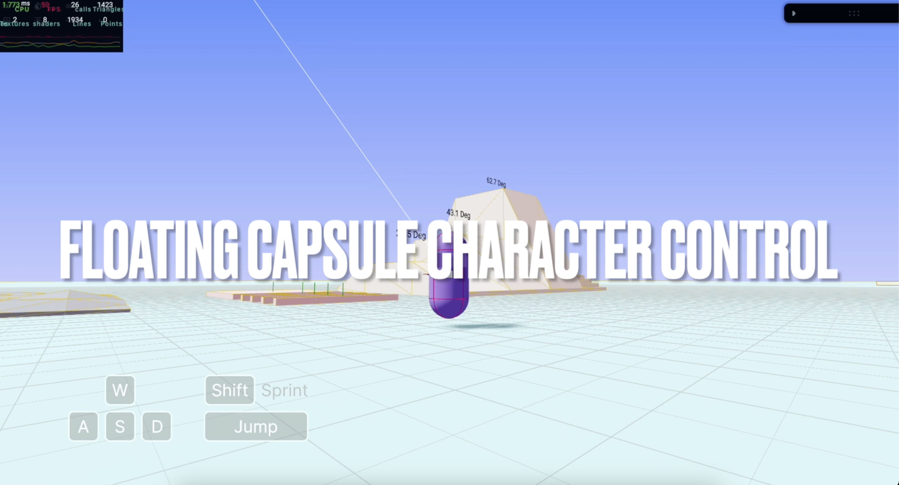

# Based on Ecctrl Floating Capsule Character Controller

[Pmndrs/ecctrl](https://github.com/pmndrs/ecctrl) is a simple web based character controller build on [react-three-fiber](https://github.com/pmndrs/react-three-fiber) and [react-three-rapier](https://github.com/pmndrs/react-three-rapier). It provides a playground demo where you can experience the following features: